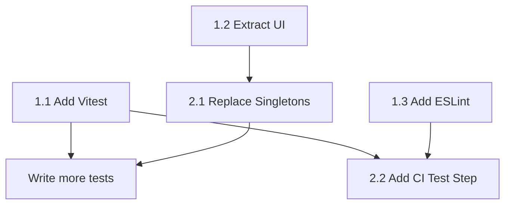

# BRICKWAVE Implementation Plan

**Based on:** CODE_REVIEW.md
**Created:** December 2025
**Status:** Ready for Implementation

---

## Overview

This plan addresses the recommended actions from the SOLID principles code review, organized into phases with specific implementation steps.

---

## Phase 1: Foundation (Tier 1 Critical Items)

### 1.1 Add Vitest + Initial Tests
**Effort:** 2-4 hours | **Priority:** Critical

**Goal:** Establish testing infrastructure and write initial tests for pure-logic managers.

**Steps:**

1. **Install Vitest and dependencies**
   ```bash
   npm install -D vitest @vitest/coverage-v8 jsdom
   ```

2. **Create Vitest configuration**
   - Create `vitest.config.js` at project root
   - Configure jsdom environment for browser APIs
   - Set up coverage thresholds

3. **Add test scripts to package.json**
   ```json
   {
     "scripts": {
       "test": "vitest",
       "test:run": "vitest run",
       "test:coverage": "vitest run --coverage"
     }
   }
   ```

4. **Create test directory structure**
   ```
   src/
   └── __tests__/
       ├── systems/
       │   ├── ScoreManager.test.js
       │   ├── PhaseManager.test.js
       │   └── SaveManager.test.js
       └── mocks/
           └── PhaserMocks.js
   ```

5. **Create Phaser mock utilities**
   - Mock `Phaser.Scene` for unit testing
   - Mock `events.emit` for event verification
   - Mock `localStorage` for SaveManager tests

6. **Write initial tests (priority order)**
   - **ScoreManager** (pure logic, easy to test)
     - Coin collection and score accumulation
     - Echo charge calculation (10 coins = 1 charge)
     - Echo charge cap at 3
     - Score multipliers
   - **PhaseManager** (core mechanic)
     - Phase timing (2-second cycles)
     - Phase state transitions
     - Brick registration/deregistration
   - **SaveManager** (critical data)
     - Progress save/load
     - Settings persistence
     - Default value fallbacks

**Files to Create:**
- `vitest.config.js`
- `src/__tests__/mocks/PhaserMocks.js`
- `src/__tests__/systems/ScoreManager.test.js`
- `src/__tests__/systems/PhaseManager.test.js`
- `src/__tests__/systems/SaveManager.test.js`

**Files to Modify:**
- `package.json` (add scripts and devDependencies)

---

### 1.2 Extract UI from GameScene
**Effort:** 4-8 hours | **Priority:** Critical

**Goal:** Reduce GameScene.js from 1,516 lines by extracting UI components.

**Steps:**

1. **Create new UI directory**
   ```
   src/
   └── ui/
       ├── PauseMenuManager.js
       ├── CompletionScreenManager.js
       └── MenuController.js
   ```

2. **Extract PauseMenuManager**
   - Move pause menu creation code (~220 lines)
   - Move navigation methods: `pauseMenuUp()`, `pauseMenuDown()`, `pauseMenuConfirm()`
   - Move selection update logic
   - Interface:
     ```javascript
     class PauseMenuManager {
       constructor(scene) {}
       show() {}
       hide() {}
       navigateUp() {}
       navigateDown() {}
       confirm() {}  // Returns action: 'resume', 'restart', 'settings', 'exit'
       isVisible() {}
     }
     ```

3. **Extract CompletionScreenManager**
   - Move completion screen creation (~230 lines)
   - Move rank calculation logic
   - Move results menu navigation
   - Interface:
     ```javascript
     class CompletionScreenManager {
       constructor(scene, scoreManager) {}
       show(stats) {}  // stats: { time, shards, score, coins }
       hide() {}
       calculateRank(stats) {}
       navigateUp() {}
       navigateDown() {}
       confirm() {}  // Returns action: 'next', 'restart', 'exit'
     }
     ```

4. **Create reusable MenuController**
   - Extract common menu navigation pattern (used 3 times)
   - Handle up/down selection with wrap-around
   - Handle visual selection updates
   - Interface:
     ```javascript
     class MenuController {
       constructor(items) {}
       moveUp() {}
       moveDown() {}
       getSelectedIndex() {}
       getSelectedItem() {}
       setOnSelectionChange(callback) {}
     }
     ```

5. **Update GameScene.js**
   - Import new UI managers
   - Replace inline code with manager method calls
   - Wire up input events to managers
   - Expected reduction: ~400+ lines

**Files to Create:**
- `src/ui/PauseMenuManager.js`
- `src/ui/CompletionScreenManager.js`
- `src/ui/MenuController.js`

**Files to Modify:**
- `src/scenes/GameScene.js` (major refactor)

---

### 1.3 Add ESLint
**Effort:** 1 hour | **Priority:** Critical

**Goal:** Catch bugs and enforce consistency.

**Steps:**

1. **Install ESLint**
   ```bash
   npm install -D eslint @eslint/js globals
   ```

2. **Create ESLint configuration**
   - Create `eslint.config.js` (flat config format)
   - Configure for ES modules and browser environment
   - Set up rules for common issues

3. **Configuration content:**
   ```javascript
   // eslint.config.js
   import js from '@eslint/js';
   import globals from 'globals';

   export default [
     js.configs.recommended,
     {
       languageOptions: {
         ecmaVersion: 2022,
         sourceType: 'module',
         globals: {
           ...globals.browser,
           Phaser: 'readonly',
         },
       },
       rules: {
         'no-unused-vars': ['error', { argsIgnorePattern: '^_' }],
         'no-console': ['warn', { allow: ['warn', 'error'] }],
         'eqeqeq': 'error',
         'no-var': 'error',
         'prefer-const': 'error',
       },
     },
   ];
   ```

4. **Add lint scripts to package.json**
   ```json
   {
     "scripts": {
       "lint": "eslint src/",
       "lint:fix": "eslint src/ --fix"
     }
   }
   ```

5. **Run initial lint and fix issues**
   - Run `npm run lint` to identify issues
   - Fix or suppress intentional patterns (e.g., debug console.log)
   - Add `// eslint-disable-next-line` for justified exceptions

**Files to Create:**
- `eslint.config.js`

**Files to Modify:**
- `package.json` (add scripts and devDependencies)
- Various source files (fix lint errors)

---

## Phase 2: Architecture Improvements (Tier 2 High Priority)

### 2.1 Replace Singletons with Dependency Injection
**Effort:** 4-6 hours | **Priority:** High

**Goal:** Enable testing and reduce coupling.

**Steps:**

1. **Identify singleton dependencies**
   - `audioManager` - used in ~15 files
   - `particleEffects` - used in ~8 files
   - `transitionManager` - used in ~10 files
   - `inputManager` - used in ~5 files
   - `saveManager` - used in ~12 files

2. **Create ServiceContainer pattern**
   ```javascript
   // src/systems/ServiceContainer.js
   export class ServiceContainer {
     constructor(scene) {
       this.audio = new AudioManager(scene);
       this.particles = new ParticleEffects(scene);
       this.transitions = new TransitionManager(scene);
       this.input = new InputManager(scene);
       this.save = new SaveManager();
     }
   }
   ```

3. **Update scenes to create and provide services**
   - Create services in scene `create()` method
   - Pass `services` object to entities that need them
   - Store on `this.scene.services` for access

4. **Refactor high-priority classes first**
   - **Player.js**: Accept `services` in constructor
   - **Enemy.js**: Accept `services` in constructor
   - **GameScene.js**: Create and distribute services

5. **Maintain backward compatibility during migration**
   - Keep singleton exports temporarily
   - Add deprecation warnings
   - Migrate gradually over multiple PRs if needed

6. **Update tests to use mock services**
   - Pass mock service objects to constructors
   - Verify service method calls

**Files to Create:**
- `src/systems/ServiceContainer.js`

**Files to Modify:**
- `src/scenes/GameScene.js`
- `src/entities/Player.js`
- `src/entities/Enemy.js` (and subclasses)
- All files importing singletons (gradual)

---

### 2.2 Add CI Test Step
**Effort:** 30 minutes | **Priority:** High

**Goal:** Prevent regressions by running tests in CI.

**Steps:**

1. **Update `.github/workflows/deploy.yml`**
   - Add lint step before build
   - Add test step before build
   - Fail deployment if tests fail

2. **Updated workflow:**
   ```yaml
   jobs:
     build-and-deploy:
       runs-on: ubuntu-latest
       steps:
         - name: Checkout
           uses: actions/checkout@v4

         - name: Setup Node.js
           uses: actions/setup-node@v4
           with:
             node-version: '20'
             cache: 'npm'
             cache-dependency-path: brickwave/package-lock.json

         - name: Install dependencies
           run: npm ci
           working-directory: brickwave

         - name: Lint
           run: npm run lint
           working-directory: brickwave

         - name: Test
           run: npm run test:run
           working-directory: brickwave

         - name: Build
           run: npm run build
           working-directory: brickwave

         # ... rest of deployment steps
   ```

**Files to Modify:**
- `.github/workflows/deploy.yml`

---

### 2.3 Create SpriteFactory
**Effort:** 2-3 hours | **Priority:** High

**Goal:** Extract procedural texture generation from Player.js.

**Steps:**

1. **Create SpriteFactory class**
   ```javascript
   // src/factories/SpriteFactory.js
   export class SpriteFactory {
     constructor(scene) {
       this.scene = scene;
       this.textureCache = new Map();
     }

     createPlayerTextures() { /* moved from Player.js */ }
     createEnemyTextures() { /* if needed */ }
     getTexture(key) { /* cache lookup */ }
   }
   ```

2. **Move texture generation code from Player.js**
   - `createPlayerTextures()` (~200 lines)
   - Animation frame definitions
   - Color palette definitions

3. **Update Player.js to use factory**
   - Accept factory or scene.spriteFactory
   - Use pre-generated textures instead of self-generating

4. **Initialize factory in scene**
   ```javascript
   create() {
     this.spriteFactory = new SpriteFactory(this);
     this.spriteFactory.createPlayerTextures();
     this.player = new Player(this, x, y);
   }
   ```

**Files to Create:**
- `src/factories/SpriteFactory.js`

**Files to Modify:**
- `src/entities/Player.js` (extract ~200 lines)
- `src/scenes/GameScene.js` (initialize factory)

---

## Phase 3: Quality Improvements (Tier 3 Medium Priority)

### 3.1 Production Logging Utility
**Effort:** 1-2 hours | **Priority:** Medium

**Goal:** Disable debug console.log in production.

**Steps:**

1. **Create Logger utility**
   ```javascript
   // src/utils/Logger.js
   const LOG_LEVELS = { debug: 0, info: 1, warn: 2, error: 3 };
   const CURRENT_LEVEL = import.meta.env.DEV ? 'debug' : 'error';

   export const logger = {
     debug: (...args) => LOG_LEVELS[CURRENT_LEVEL] <= 0 && console.log('[DEBUG]', ...args),
     info: (...args) => LOG_LEVELS[CURRENT_LEVEL] <= 1 && console.info('[INFO]', ...args),
     warn: (...args) => LOG_LEVELS[CURRENT_LEVEL] <= 2 && console.warn('[WARN]', ...args),
     error: (...args) => console.error('[ERROR]', ...args),
   };
   ```

2. **Replace console.log calls gradually**
   - Search for `console.log` in codebase
   - Replace with `logger.debug()` or `logger.info()`
   - Keep `console.error` for actual errors

3. **Update debug code guards**
   ```javascript
   // main.js
   if (import.meta.env.DEV) {
     window.game = game;
   }
   ```

**Files to Create:**
- `src/utils/Logger.js`

**Files to Modify:**
- Multiple files with console.log statements
- `src/main.js` (conditional debug exposure)

---

### 3.2 LevelLoader Validation
**Effort:** 1 hour | **Priority:** Medium

**Goal:** Prevent crashes on invalid level data.

**Steps:**

1. **Add validation to LevelLoader.loadLevel()**
   ```javascript
   loadLevel(levelData) {
     if (!this.validateLevelData(levelData)) {
       console.error('Invalid level data');
       return this.loadFallbackLevel();
     }
     // ... existing code
   }

   validateLevelData(data) {
     if (!data) return false;
     if (!data.layers || !Array.isArray(data.layers)) return false;
     if (typeof data.width !== 'number') return false;
     if (typeof data.height !== 'number') return false;
     return true;
   }

   loadFallbackLevel() {
     // Load a safe default level
   }
   ```

2. **Add layer validation**
   - Verify required layer types exist
   - Handle missing tile data gracefully

**Files to Modify:**
- `src/systems/LevelLoader.js`

---

### 3.3 Fix Array Iteration Bug
**Effort:** 30 minutes | **Priority:** Medium

**Goal:** Fix array modification during iteration.

**Steps:**

1. **Find all forEach with splice patterns**
   - Search for `.forEach` combined with `.splice`

2. **Replace with reverse iteration**
   ```javascript
   // Before (buggy)
   this.coins.forEach((coin, index) => {
     if (shouldRemove) {
       this.coins.splice(index, 1);
     }
   });

   // After (correct)
   for (let i = this.coins.length - 1; i >= 0; i--) {
     if (shouldRemove) {
       this.coins.splice(i, 1);
     }
   }
   ```

3. **Alternative: Use filter for immutable approach**
   ```javascript
   this.coins = this.coins.filter(coin => !shouldRemove);
   ```

**Files to Modify:**
- `src/scenes/GameScene.js` (likely location)
- Any other files with this pattern

---

### 3.4 TypeScript Migration (Optional/Future)
**Effort:** 8+ hours | **Priority:** Medium (Long-term)

**Goal:** Add type safety for safer refactoring.

**Note:** This is a larger undertaking. Consider as a future phase.

**Preparation Steps:**

1. **Install TypeScript dependencies**
   ```bash
   npm install -D typescript @types/node
   ```

2. **Create tsconfig.json**
   - Enable `allowJs` for gradual migration
   - Set `strict: false` initially
   - Configure path aliases

3. **Migration strategy**
   - Start with utility files (utils/, config.js)
   - Move to systems (pure logic managers)
   - Finally migrate scenes and entities

**Files to Create:**
- `tsconfig.json`

---

## Phase 4: Polish (Tier 4 Nice to Have)

### 4.1 Build Configuration Improvements
**Effort:** 30 minutes | **Priority:** Low

**Steps:**

1. **Update vite.config.js**
   ```javascript
   export default defineConfig(({ mode }) => ({
     build: {
       sourcemap: mode === 'development',
       rollupOptions: {
         output: {
           manualChunks: {
             phaser: ['phaser'],
           },
         },
       },
     },
   }));
   ```

2. **Benefits**
   - Source maps for debugging (dev only)
   - Phaser in separate chunk for better caching

**Files to Modify:**
- `vite.config.js`

---

### 4.2 Reduced Motion Accessibility
**Effort:** 2-3 hours | **Priority:** Low

**Steps:**

1. **Add reduced motion setting to SaveManager**
2. **Check `prefers-reduced-motion` media query**
3. **Disable particle effects when enabled**
4. **Reduce screen shake intensity**
5. **Add toggle to SettingsScene**

**Files to Modify:**
- `src/systems/SaveManager.js`
- `src/systems/ParticleEffects.js`
- `src/scenes/SettingsScene.js`

---

## Implementation Order

```
Week 1: Foundation
├── Day 1-2: Add Vitest + write ScoreManager tests (1.1)
├── Day 3: Add ESLint and fix issues (1.3)
└── Day 4-5: Extract PauseMenuManager (1.2 partial)

Week 2: Continue Foundation + CI
├── Day 1-2: Extract CompletionScreenManager (1.2 complete)
├── Day 3: Add CI test step (2.2)
└── Day 4-5: Create SpriteFactory (2.3)

Week 3: Architecture
├── Day 1-3: Replace singletons with DI (2.1)
├── Day 4: Production logging utility (3.1)
└── Day 5: LevelLoader validation + array fix (3.2, 3.3)

Week 4: Polish
├── Build configuration improvements (4.1)
└── Accessibility improvements (4.2)
```

---

## Success Metrics

| Phase | Metric | Target |
|-------|--------|--------|
| 1.1 | Test coverage | >50% for tested files |
| 1.2 | GameScene.js lines | <1,100 lines (from 1,516) |
| 1.3 | ESLint errors | 0 errors, <20 warnings |
| 2.1 | Singleton imports | 0 direct singleton imports |
| 2.2 | CI pipeline | All checks passing |

---

## Dependencies



---

## Risk Mitigation

| Risk | Mitigation |
|------|------------|
| Breaking existing functionality | Write tests for current behavior first |
| Large refactors causing merge conflicts | Small, focused PRs with clear scope |
| DI migration complexity | Gradual migration, keep singletons during transition |
| Time overruns | Prioritize Tier 1 items, defer Tier 4 |

---

## Notes

- Each item should be a separate PR for easy review
- Run full test suite and manual gameplay test before merging
- Update CODE_REVIEW.md as improvements are completed
- Consider pairing on complex refactors (GameScene extraction, DI migration)

---

*Plan created December 2025. Update as implementation progresses.*
